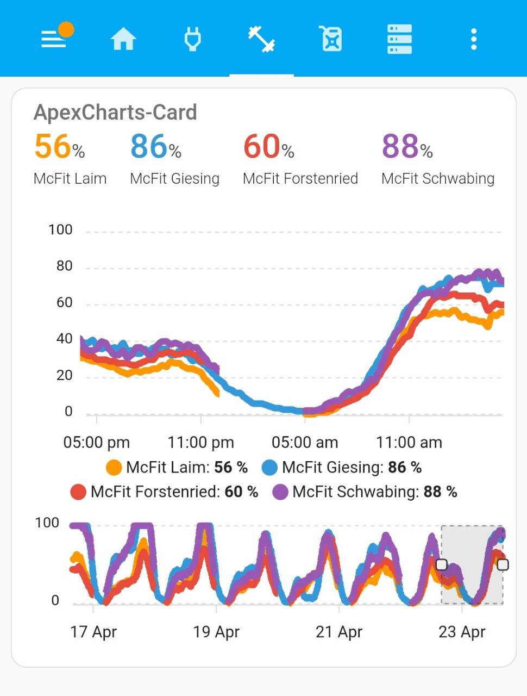

## McFit occupancy rate checker

As Sam Palmisano once demanded: Making the world work out better.
Or was it just work? Anyway, with this small script I am providing answers to the real questions, like what's the occupancy rate of your local gym. 

### How?
Add apexcharts_card.yaml to lovelace via the homeassistent UI.
Add credentials to mqtt.ini.
Add scheduled execution for mc_fit_utilization_checker.py. 

